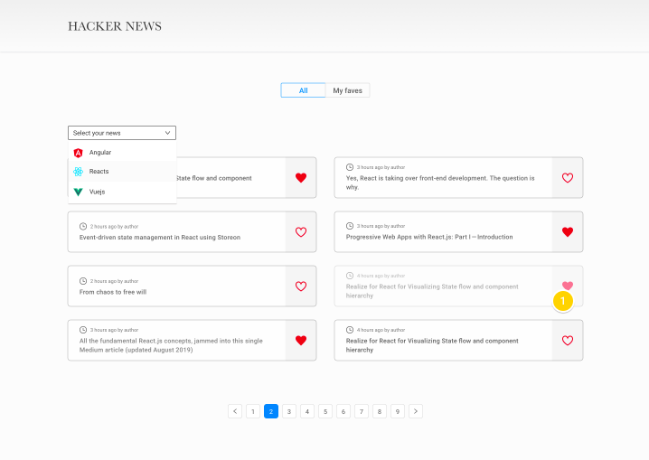
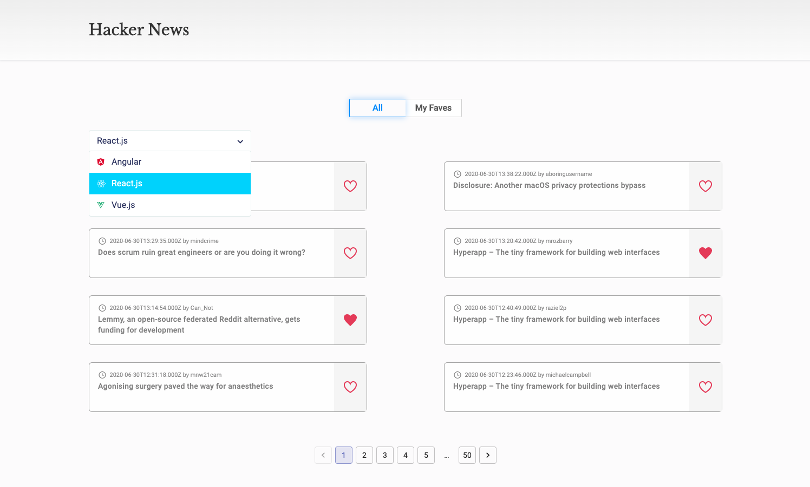

# 
# Hacker News Display 

## Technologies: 🛠️
This project was created with: 
- React.js
- Hooks
- CSS 3
- Flexbox
- Search Hacker News API
- Material-UI Pagination
- react-loader-spinner

## Design: 🎨
The design was based on the requirements sent:

Final result:
 

## Deploy 🚀

The link of the deploy in [Netlify](https://hacker-news-display.netlify.app)